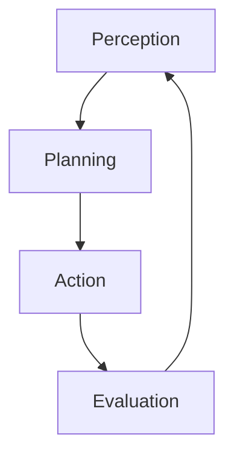

# Agentic RAG, corrective rag (CRAG)

Retrieving information to help generative AI is a delicate process, it is easy to get started with searches adn vector searches but it is hard to ensure the right data is loaded. **Agentic RAG** approaches are bringing in more power and approaches to load context to satisfy the user requests and application goals.

In its msot simple form an agent perform the following loop


Using generative ai and providing tools to teh `Action` step the agent is able to consume additional logic.

**Corrective RAG** systems (**CRAG**) reson about the user request and the current context, it then evaluates how supportive and useful it is, if the context can help accomplising the task the response is generated otherwise it will plan actions to cover the gap in the context. A classic approach here is to try to use in house data (this could be a vector search like in [RAG Chatbot](6_RAGChatbot.md)) and after evaluating the context relevancy it might need to search the web using search engine like [Bing](www.bing.com) to supplement the missing parts. It could also generate better query to probe again the **RAG** element

In this exercise you will build on top of the [RAG Chatbot](6_RAGChatbot.md) and tool calling example to implement a **CRAG** system for the [eShopSupport](https://github.com/dotnet/eShopSupport)

## Project setup

*Prerequisites: These instructions assume you've done earlier sessions, in particular session 1, which gives the basic environment setup steps.*

If you're not already running Qdrant, start it in Docker now:

```
docker run -p 6333:6333 -p 6334:6334 -v qdrant_storage:/qdrant/storage:z -d qdrant/qdrant
```

If you have not populate (if you already completed the [RAG Chatbot](6_RAGChatbot.md) lesson you should be good to go now) the collection then load pdfs:

 * Open the project `exercises/CorrectiveRetrievalAugmentedGeneration/Begin`
 * If you're using VS, ensure that `Ingestion` is marked as the startup project. For non-VS users, `Ingestion` is the project you should be ready to `dotnet run`.
 * Open `Program.cs`. Follow the instructions at the top, which explain how to:
   * Make sure Ollama is running and has the `all-minilm` model available
   * Make sure Qdrant, a vector database, is running in Docker

If you run the project, you should see it claim to ingest many PDFs, this is will populate a collection in the [Qdrant](https://qdrant.tech/) .

This might take a minute or so. While it's going, you might like to go into the Qdrant dashboard at http://localhost:6333/dashboard. You should see it has a single collection called `manuals`, and if you go into it and visit the *Info* tab, it should say it has `points_count` of some amount. It doesn't update continuously, but if you refresh every few seconds you'll see the count go up.

When your ingestion process completes, you should have thousands of "points" (i.e., chunks of text from product manuals) in your vector database.

## Implementing the CRAG chatbot

Switch over to work on the `CorrectiveRetrievalAugmentedGenerationApp` project.

 * For VS users, set `CorrectiveRetrievalAugmentedGenerationApp` as the startup project
 * Everyone else, prepare to `dotnet run` in the `CorrectiveRetrievalAugmentedGenerationApp` directory

In `Program.cs`, you'll see there's quite a lot of setup code. But none of this is a chatbot at all. It's just setting up an `IChatClient`, and `IEmbeddingGenerator`, and a `QdrantClient`.

Find where `IChatClient innerChatClient` is declared and make sure it's using the LLM backend you want to use, likely either Azure OpenAI or Ollama.

### Ranking and filtering RAG results 

Inside `ChatbotThread.cs`, you'll see that `AnswerAsync` currently just perfoming a search oepration over the manual chunks and then trying to generate the answer.

The approach here is the **Predetermined context** as see in the [RAG Chatbot](6_RAGChatbot.md) sample, the code gets the 3 best matches it can find in the vector store.

We will take this further and use the LLM to evaluate how relevant are the chunks we have retrieved. 
The class `ContextRelevancyEvaluator` can help us ranking and filtering the chunks. 

When performing the semantic search we have found the closest matches using vector search, this is a similarity measure, not a measure of how relevant are the chunks to the user question.
Using LLM to reason about **Context Relevancy** means to ask it to score how useful is the context to satisfy a user question.

We will use it to refine the chunk to be used later in the answer generation. The code to filter will look like the following

```cs
Dictionary<ulong, Chunk> chunksForResponseGeneration = [];

// calculate relevancy

ContextRelevancyEvaluator contextRelevancyEvaluator = new(chatClient);

foreach (var retrievedContext in closestChunksById.Values)
{
    var score = await contextRelevancyEvaluator.EvaluateAsync(userMessage, retrievedContext.Text, cancellationToken);
    if (score.ContextRelevance!.ScoreNumber > 0.7)
    {
        chunksForResponseGeneration.Add(retrievedContext.Id, retrievedContext);
    }
}
```
Inside the `ContextRelevancyEvaluator.cs` file we can see the logic used to ask the LLM to perform ranking:

```cs
public async Task<EvaluationResponse> EvaluateAsync(string question, string context, CancellationToken cancellationToken)
{
    bool isOllama = chatClient.GetService<OllamaChatClient>() is not null;

    // Assess the quality of the answer
    // Note that in reality, "relevance" should be based on *all* the context we supply to the LLM, not just the citation it selects
    var response = await chatClient.CompleteAsync<EvaluationResponse>($$"""
    There is an AI assistant that helps customer support staff to answer questions about products.
    You are evaluating the quality of the answer given by the AI assistant for the following question.

    <question>{{question}}</question>
    <context>{{context}}</context>

    You are to provide two scores:

    1. Score the relevance of <context> to <question>.
       Does <context> contain information that may answer <question>?


    Each score comes with a short justification, and must be one of the following labels:
     * Awful: it's completely unrelated to the target or contradicts it
     * Poor: it misses essential information from the target
     * Good: it includes the main information from the target, but misses smaller details
     * Perfect: it includes all important information from the target and does not contradict it

    Respond as JSON object of the form {
        "ContextRelevance": { "Justification": string, "ScoreLabel": string },
    }
    """, useNativeJsonSchema: isOllama, cancellationToken: cancellationToken);

    if (response.TryGetResult(out var score) && score.Populated)
    {

        return score;
    }

    throw new InvalidOperationException("Invalid response from the AI assistant");
}
```
Returning a structured object instead of a string makes it easier to integrate LLM in traditional code.

### Correcting the aim

Now that we have discarded non relevant context we might need additional material. This is the corrective part of the algorythm.
There are few approaches possible

1. **Query Rewriting**
  
  [Query Rewriting](https://medium.com/@florian_algo/advanced-rag-06-exploring-query-rewriting-23997297f2d1)
  uses the current avilable context and user question we ask llm to generate new questions that can help addressing the original user goal. We can for example have 5 more questions and use this ones again to load chunks from the **RAG** system.

2. **HyDE (Hypothetical Document Embeddings)**
  This approach is about enhancing information retrieval by using "fake" or hypothetical documents. 

  [HyDE](https://medium.com/etoai/advanced-rag-precise-zero-shot-dense-retrieval-with-hyde-0946c54dfdcb) uses (LLMs) to generate hypothetical answers to queries. These answers are then turned into vector embeddings and placed in the same space as real documents. When a search is performed, the system finds real documents that best match the hypothetical answer, even if they don't match the exact words in the search query. This method captures the intent behind the query, ensuring that the retrieved documents are contextually relevant.