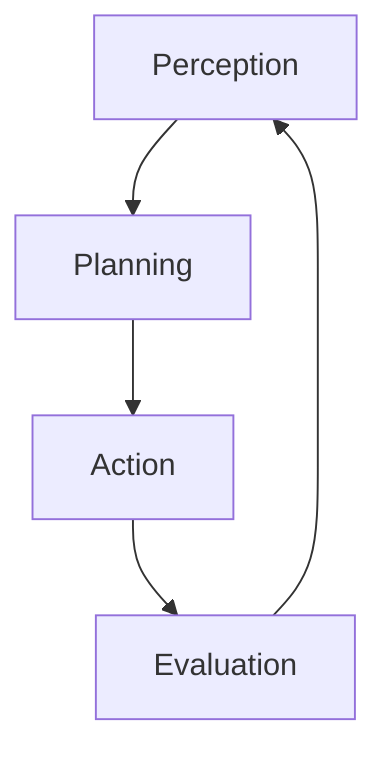

# Agentic RAG and Corrective RAG (CRAG)

Retrieving information to help generative AI is a delicate process. It is easy to get started with searches and vector searches, but it is hard to ensure the right data is loaded. **Agentic RAG** approaches bring in more power to load context to satisfy user requests and application goals.

In its most simple form, an agent performs the following loop:



Using generative AI and providing tools to the `Action` step, the agent is able to consume additional logic.

A **corrective retrieval-augmented generation (CRAG)** system reasons about the user request and the current context. It evaluates how supportive and useful the context is. If the context is sufficient to accomplish the task, the response is generated. Otherwise, the system will plan actions to cover the gap in the context.

A classic approach here is to try to use in-house data, often a vector search as in basic RAG. After evaluating the context relevance, the system may choose to supplement the missing parts by searching the web using a search engine like [Bing](https://www.bing.com). Alternatively the system may generate a better query to probe again within the RAG element. 

In this exercise you will build on top of the earlier [RAG chatbot and tool calling example](./6_RAGChatbot.md) to implement a CRAG system.

If you want to use **Bing** search tool you will need to provision keys, follow the instructions [here](https://learn.microsoft.com/en-us/bing/search-apis/bing-web-search/create-bing-search-service-resource).

As an alternative you can use the class `DuckDuckGoSearchTool` in `DuckDuckGoSearchTool.cs`

## Project setup

*Prerequisites: These instructions assume you've done earlier sessions, in particular session 1, which gives the basic environment setup steps.*

If you're not already running Qdrant, start it in Docker now:

```
docker run -p 6333:6333 -p 6334:6334 -v qdrant_storage:/qdrant/storage:z -d qdrant/qdrant
```
Check it is working by opening the [dashboard](http://localhost:6333/dashboard), it should show the collection and the points.


### Populating Qdrant

If your Qdrant Docker volume (`qdrant_storage`) already contains the sample PDF chunks because you did the [RAG Chatbot](6_RAGChatbot.md) session, you can skip this part.

Otherwise, populate your Qdrant storage as follows:

 * Open the project `exercises/RetrievalAugmentedGeneration/End` (and notice this path contains `End`, not `Begin`)
 * If you're using VS, ensure that `Ingestion` is marked as the startup project. For non-VS users, `Ingestion` is the project you should be ready to `dotnet run`.
 * Open `Program.cs`. Follow the instructions at the top, which explain how to:
   * Make sure Ollama is running and has the `all-minilm` model available
   * Make sure Qdrant, a vector database, is running in Docker

If you run the project, you should see it claim to ingest many PDFs. This will populate a collection in Qdrant. This might take a minute or two.

To learn more about how PDFs are ingested (i.e., how they are parsed, chunked, and embedded), you can refer back to the [RAG Chatbot](6_RAGChatbot.md) session.

### Starting services

Make sure you're running Ollama and that you have the `all-minilm` model available. If you're not sure, run:

```
ollama pull all-minilm
ollama serve
```

If `ollama serve` returns the error *tcp 127.0.0.1:11434: bind: Only one usage of each socket address*, be sure to first close any existing instance of Ollama (e.g., from the system tray on Windows) before running `ollama serve` again.

## Implementing the CRAG chatbot

Switch over to work on the CRAG project:

 * Open the project `exercises/CorrectiveRetrievalAugmentedGeneration/Begin`
 * For VS users, set `CorrectiveRetrievalAugmentedGenerationApp` as the startup project
 * Everyone else, prepare to `dotnet run` in the `CorrectiveRetrievalAugmentedGenerationApp` directory

In `Program.cs`, you'll see there's quite a lot of setup code. But none of this is a chatbot at all. It's just setting up an `IChatClient`, and `IEmbeddingGenerator`, and a `QdrantClient`.

Find where `IChatClient innerChatClient` is declared and make sure it's using the Azure OpenAI backend as we will require to perform structured parsing.

### Ranking and filtering RAG results 

Inside `ChatbotThread.cs`, you'll see that `AnswerAsync` currently just performs a search operation over the manual chunks and then tries to generate an answer.

The approach here is *predetermined context* as seen in the [RAG Chatbot](6_RAGChatbot.md) sample. The code gets the 3 best matches it can find in the vector store.

We will take this further and use the LLM to evaluate how relevant are the chunks we have retrieved. 
The class `ContextRelevancyEvaluator` can help us ranking and filtering the chunks. 

When performing the semantic search we have found the closest matches using vector search. This is a similarity measure, not a measure of how relevant the chunks are to the user question.
Using an LLM to reason about *context relevancy* means to ask it to score how useful the context is to satisfying a user question.

Let's do it. Inside `ChatbotThread.cs`'s `AnswerAsync` method, replace these lines:

```cs
// For basic RAG, we just add *all* the chunks to context, ignoring relevancy
var chunksForResponseGeneration = closestChunksById.Values.ToDictionary(c => c.Id, c => c);
```

... with this improved alternative:

```cs
// For improved RAG, add only the truly relevant chunks to context
ContextRelevancyEvaluator contextRelevancyEvaluator = new(chatClient);
double averageScore = 0;
foreach (var retrievedContext in closestChunksById.Values)
{
    var score = await contextRelevancyEvaluator.EvaluateAsync(userMessage, retrievedContext.Text, cancellationToken);
    if (score.ContextRelevance!.ScoreNumber > 0.7)
    {
        averageScore += score.ContextRelevance!.ScoreNumber;
        chunksForResponseGeneration.Add(retrievedContext.Id, retrievedContext);
    }
}

averageScore /= chunksForResponseGeneration.Count;
```

You can use this code to filter the retrieved manual chunks to keep only the most relevant to the question and keeping track the overall relevancy of the final set.

### How re-ranking works

Inside `ContextRelevancyEvaluator.cs` we can see the logic used to ask the LLM to perform ranking:

```cs
public async Task<EvaluationResponse> EvaluateAsync(string question, string context, CancellationToken cancellationToken)
{
    // Assess the quality of the answer
    // Note that in reality, "relevance" should be based on *all* the context we supply to the LLM, not just the citation it selects
    var response = await chatClient.CompleteAsync<EvaluationResponse>($$"""
    There is an AI assistant that helps customer support staff to answer questions about products.
    You are evaluating the quality of the answer given by the AI assistant for the following question.

    <question>{{question}}</question>
    <context>{{context}}</context>

    You are to provide two scores:

    1. Score the relevance of <context> to <question>.
       Does <context> contain information that may answer <question>?


    Each score comes with a short justification, and must be one of the following labels:
     * Awful: it's completely unrelated to the target or contradicts it
     * Poor: it misses essential information from the target
     * Good: it includes the main information from the target, but misses smaller details
     * Perfect: it includes all important information from the target and does not contradict it

    Respond as JSON object of the form {
        "ContextRelevance": { "Justification": string, "ScoreLabel": string },
    }
    """, useNativeJsonSchema: true, cancellationToken: cancellationToken);

    if (response.TryGetResult(out var score) && score.Populated)
    {
        return score;
    }

    throw new InvalidOperationException("Invalid response from the AI assistant");
}
```
Returning a structured object instead of a string makes it easier to integrate an LLM in traditional code.

### Correcting the aim

Now that we have discarded irrelevant context we might need additional material. This is the corrective part of the algorithm. 
We might end with a `chunksForResponseGeneration` collection that does not contain enough (or at all) material, we need to find ways to improve it by adding more content there.

There are few approaches possible, some of the most common are:

1. **Query rewriting**
  
   [Query rewriting](https://medium.com/@florian_algo/advanced-rag-06-exploring-query-rewriting-23997297f2d1) takes the current available context and user question, and asks the LLM to generate new questions that could address the user's original goal. For example, we could generate five more questions (i.e., different phrasings of the user's goal) and use these to load more chunks from the vector store.

2. **HyDE (Hypothetical Document Embeddings)**

   Instead of generating hypothetical user inputs as above, [HyDE](https://medium.com/etoai/advanced-rag-precise-zero-shot-dense-retrieval-with-hyde-0946c54dfdcb) generates hypothetical documents to be indexed in your vector store.

   This is done using LLMs to generate hypothetical answers to queries. These answers are then turned into vector embeddings and placed in the same space as real documents. When a search is performed, the system may find these hypothetical documents, and if it does, the search results are amended to be the corresponding real documents from which the hypotheticals were derived.

*Query rewriting* and *HyDE* are closely related in that they both aim to improve retrieval by allowing for alternate ways to phrase things. A difference between the two is that query rewriting computes those alternatives at runtime during each query, whereas HyDE computes the alternatives just once up front.

### Reasoning in agentic workflow

Agentic approach to *RAG* takes a different way.
Agents implement a loop, when reasoning they use the context and the objective to formulate a plan. In the loop they perform some action which can change the current context.
Changes to the context could lead to plan changes or the final goal. 

Worth mentioning [ReAct](https://docs.llamaindex.ai/en/stable/examples/agent/react_agent_with_query_engine/) and [Flare](https://docs.llamaindex.ai/en/stable/examples/query_engine/flare_query_engine/) retrieval approaches. They make a single step of retrieval and try to explore the problem space a step at a time, reasoning on the knowledge gaps to fill and how to search the information to address such gaps. They use a limited amount of tokens because as they loop they mutate the current state without an overall vision. This get get into infinite loops as the agent doesn't know what has been already explored, is just focused on accomplishing the final goal.

We will be using a **Plan, Step, Eval** approach, so we can keep looking at the overall trajectory and what we have accomplished so far.

First let's break down few things we need to consider and use.

#### Making plans

LLMs can generate plans to accomplish a goal giving us back a list of steps. If we use text in and text out the agentic loop becomes very weak as it will be as strong as the parsing logic will be. To improve our work we will be forcing the LLM itself to reason in terms of structured objects. In the project `StructuredPrediction` You will find some utilities to create a `IStructuredPredictor` from a `IChatClient`, have a look at the tests for the project.
Since we will be using the `Planner` project this is how to use the structured parser.

In the following snippet we are using it to create a plan (see the implementation of the `PlanGenerator` class)

```csharp
// create a structured predictor
IStructuredPredictor structuredPredictor = chatClient.ToStructuredPredictor([typeof(Plan)]);

// user it to obtain a plan
StructuredPredictionResult result = await structuredPredictor.PredictAsync([new ChatMessage(ChatRole.User, "create a plan to go to the moon")]);
if (result.Value is not Plan plan)
{
    throw new InvalidOperationException("No plan generated");
}
```

We can provide a list of types when creating a `IStructuredPredictor`, this will accomplish the same as passing a discriminated union.
The objective is to force the choice of one of the type provided.
This makes it easier to write our **plan-execute-eval** loop as a plain and clear csharp algorithm.

For example we can now write a loop that tries to look for more data to answer the user question like this:
```cs
var planGenerator = new PlanGenerator(chatClient);

var toolCallingClient = new FunctionInvokingChatClient(chatClient);
var stepExecutor = new PlanExecutor(toolCallingClient);

var evaluator = new PlanEvaluator(chatClient);

string task = $"""
                Given the <user_question>, search the product manuals for relevant information.
                Look for information that may answer the question, and provide a response based on that information.
                The <context> was not enough to answer the question. Find the information that can complement the context to address the user question

                <user_question>
                {userMessage}
                </user_question>

                <context>
                {string.Join("\n", closestChunksById.Values.Select(c => $"<manual_extract id='{c.Id}'>{c.Text}</manual_extract>"))}
                </context>
                """;

var plan = await planGenerator.GeneratePlanSync(
    task
    , cancellationToken);

List<PanStepExecutionResult> pastSteps = [];

var res = await  stepExecutor.ExecutePlanStep(plan, cancellationToken: cancellationToken);
pastSteps.Add(res);

var planOrResult = await evaluator.EvaluatePlanAsync(task, plan, pastSteps, cancellationToken);

while (planOrResult.Plan is not null)
{
    res = await stepExecutor.ExecutePlanStep(plan, cancellationToken: cancellationToken);
    pastSteps.Add(res);

    planOrResult = await evaluator.EvaluatePlanAsync(task, plan, pastSteps, cancellationToken);
}

var answer = planOrResult.Result?.Outcome ?? "Sorry could not answer your question";
```

This code block implements the loop we described at the beginning of this document. Every time only the first step of the plan is executed. With the outcome we ask the evaluator to perform a choice. If the task is done it will produce a non null `planOrResult.Result.Outcome`, that will contain the final answer. If more work is needed a new plan will be calculated taking into account all previous steps done and their results. 
The collection `pastSteps` is here to reduce the risk of infinite loop (at the cost of bigger token count as the plan unfolds). 
Since we are using a structured parsing approach (have a look at projects like [TypeChat](https://github.com/microsoft/typechat.net)) to see the power and control that this techniques gives compared to parsing.
This is a good way to combine stochastic behaviours of LLMs (Machine learning in general) and deterministic behaviour of algorithms and data structures.
The objective here is to find more material and to do so we need some tools. If you want to use the **Bing** search tool you will need your own BingAPI keys. Make sure to add it to the user secrets, they should look like this
```js
{
  "AzureOpenAI": {
    "Endpoint": "",
    "Key": ""
  },
  "BingSearch": {
    "Key": ""
  }
}
```


Let's create an instance of the client code, we can put it in the service collection in `Program.cs`:
```cs
builder.Services.AddSingleton(b =>
{
    var httpClient = new HttpClient();
    return new BingSearchTool(
        builder.Configuration["BingSearch:Key"]!,
        httpClient);
});
```

Then modify the `Chatbot.cs` to introduce a dependency on the tool, modify the constructor like this:
```cs
public class Chatbot(
    IChatClient chatClient,
    IEmbeddingGenerator<string, Embedding<float>> embeddingGenerator,
    QdrantClient qdrantClient,
    BingSearchTool bingSearch)
    : IHostedService
```

pass it to the `ChatbotThread` constructor:
```cs
ChatbotThread thread = new(chatClient, embeddingGenerator, qdrantClient, currentProduct, bingSearch);
```

Now we want to edit the code in `ChatbotThread.cs` for the `AnswerAsync` so we can create the tool and the `ChatOptions`, you can use the following snippet to setup the options.
This code snippet gives us a tool that the `PlanExecutor` can access and invoke for searching the web for additional content.
```cs
async Task<string> SearchTool([Description("The questions we want to answer searching bing")] string userQuestion)
{
    var results = await bingSearchTool!.SearchWebAsync(userQuestion, 3, cancellationToken);

    return string.Join("\n", results.Select(c => $"""
                                                  ## web page: {c.Url}
                                                  # Content
                                                  {c.Snippet}

                                                  """));
}

var options = new ChatOptions
{
    Tools =
    [
        AIFunctionFactory.Create(SearchTool, name: "bing_web_search",
            description: "This tools uses bing to search the web for answers")
    ],
    ToolMode = ChatToolMode.Auto
};
```

You can write the **corrective** loop like this:
```cs
if (chunksForResponseGeneration.Count < 2 || averageScore < 0.7)
{
    var planGenerator = new PlanGenerator(chatClient);

    var toolCallingClient = new FunctionInvokingChatClient(chatClient);
    var stepExecutor = new PlanExecutor(toolCallingClient);

    var evaluator = new PlanEvaluator(chatClient);

    string task = $"""
                    Given the <user_question>, search the product manuals for relevant information.
                    Look for information that may answer the question, and provide a response based on that information.
                    The <context> was not enough to answer the question. Find the information that can complement the context to address the user question

                    <user_question>
                    {userMessage}
                    </user_question>

                    <context>
                    {string.Join("\n", closestChunksById.Values.Select(c => $"<manual_extract id='{c.Id}'>{c.Text}</manual_extract>"))}
                    </context>
                    """;

    var plan = await planGenerator.GeneratePlanSync(
        task
        , cancellationToken);

    List<PanStepExecutionResult> pastSteps = [];

    // pass bing search ai function so that the executor can search web for additional material
    async Task<string> SearchTool([Description("The questions we want to answer searching bing")] string userQuestion)
    {
        var results = await bingSearchTool!.SearchWebAsync(userQuestion, 3, cancellationToken);

        return string.Join("\n", results.Select(c => $"""
                                                        ## web page: {c.Url}
                                                        # Content
                                                        {c.Snippet}

                                                        """));
    }

    var options = new ChatOptions
    {
        Tools =
        [
            AIFunctionFactory.Create(SearchTool, name: "bing_web_search",
                description: "This tools uses bing to search the web for answers")
        ],
        ToolMode = ChatToolMode.Auto
    };

    var res = await stepExecutor.ExecutePlanStep(plan, options: options, cancellationToken: cancellationToken);
    pastSteps.Add(res);

    var planOrResult = await evaluator.EvaluatePlanAsync(task, plan, pastSteps, cancellationToken);

    while (planOrResult.Plan is not null)
    {
        plan = planOrResult.Plan;
        res = await stepExecutor.ExecutePlanStep(plan, options: options, cancellationToken: cancellationToken);
        pastSteps.Add(res);

        planOrResult = await evaluator.EvaluatePlanAsync(task, plan, pastSteps, cancellationToken);
    }

    // we add a fake entry to the chunks by id so that we can add the answer to the context
    ulong maxKey = chunksForResponseGeneration.Count == 0 ? 0 : chunksForResponseGeneration.Keys.Max();
    ulong key = maxKey + 1;
    if (planOrResult.Result is not null)
    {
        chunksForResponseGeneration[key] = new Chunk(

            Id: key,
            Text: planOrResult.Result.Outcome,
            ProductId: currentProduct.ProductId,
            PageNumber: 1
        );
    }
}
```
The code is now triggering if the `chunksForResponseGeneration` is not of sufficient quality. The corrective retrieval is triggered and executed until an `Outcome` is available. Put this code in the `AnswerAsync` after the **re-ranking** section.
The code block:
```cs
// we add a fake entry to the chunks by id so that we can add the answer to the context
ulong maxKey = chunksForResponseGeneration.Count == 0 ? 0 : chunksForResponseGeneration.Keys.Max();
ulong key = maxKey + 1;
if (planOrResult.Result is not null)
{
    chunksForResponseGeneration[key] = new Chunk(

        Id: key,
        Text: planOrResult.Result.Outcome,
        ProductId: currentProduct.ProductId,
        PageNumber: 1
    );
}
```

Uses the correction outcome to add a reference entry, this collection is used to produce the final answer back to the customer including the citation.
Use the code so far as a starting point to modify the `AnswerAsync` method in `ChatbotThread.cs`.
Now if the content our rag found is not enough to support the user question web searches will be used to supplement the set.
We don't need to use **Bing** search, we can use this loop to probe better our rag. 

We can use a combination of **reasoning** and **query rewriting** to rephrase the user question to probe in different ways the `Qdrant` vector store too. 
Be careful that we still need to ensure we do not perform infinite loops.

This is an example asking questions that are using the planner:
